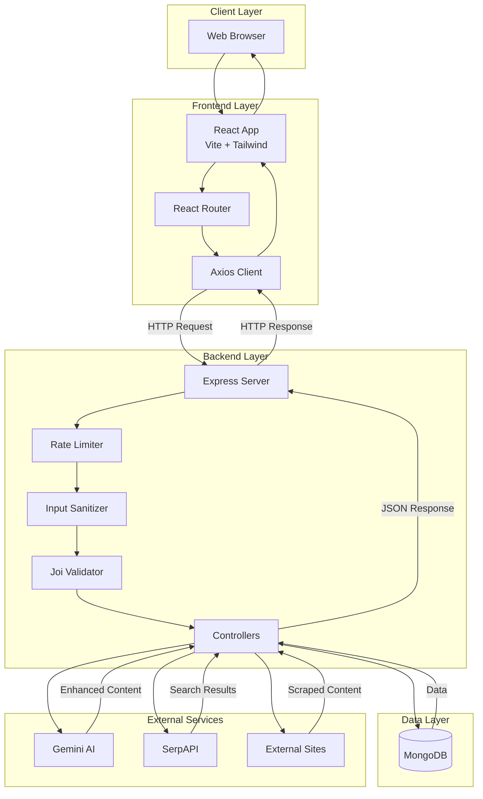
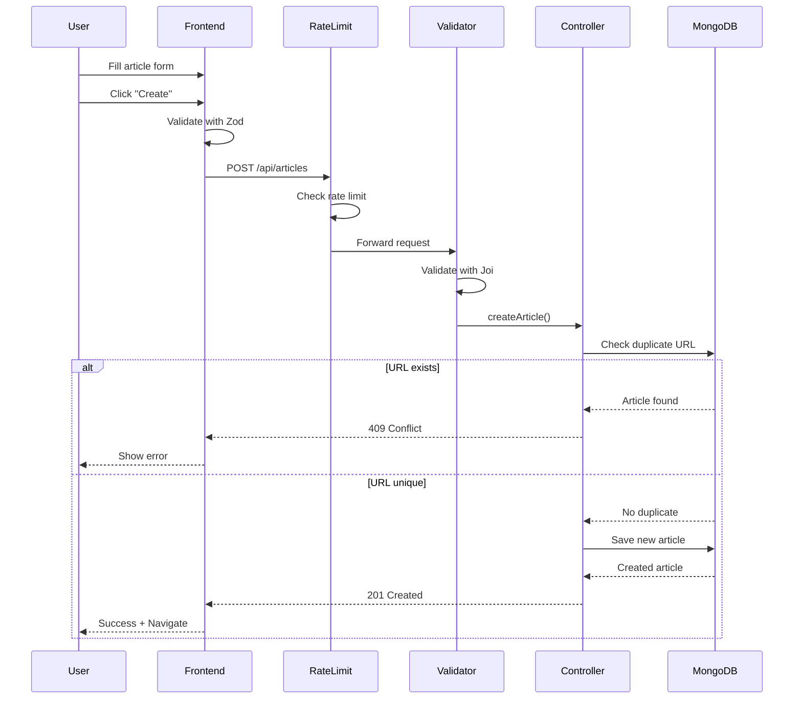
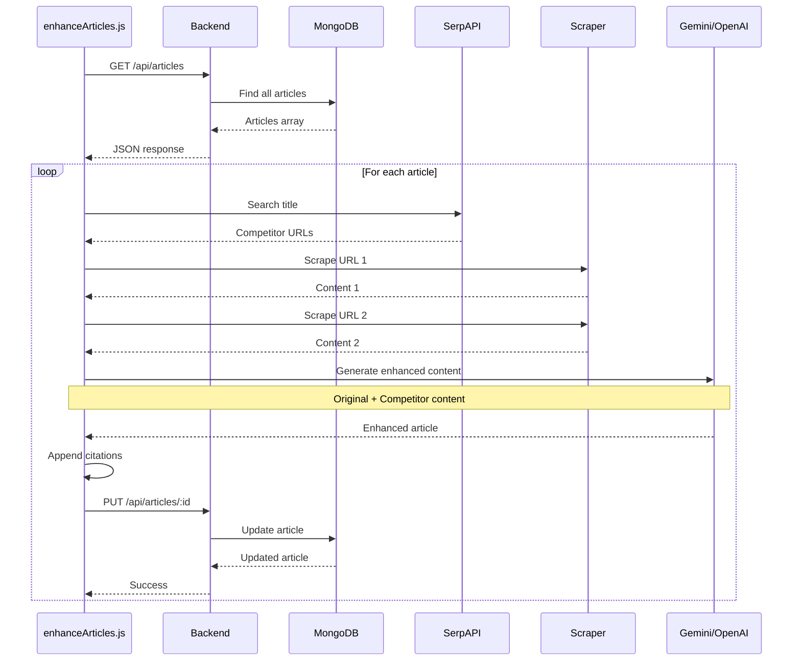
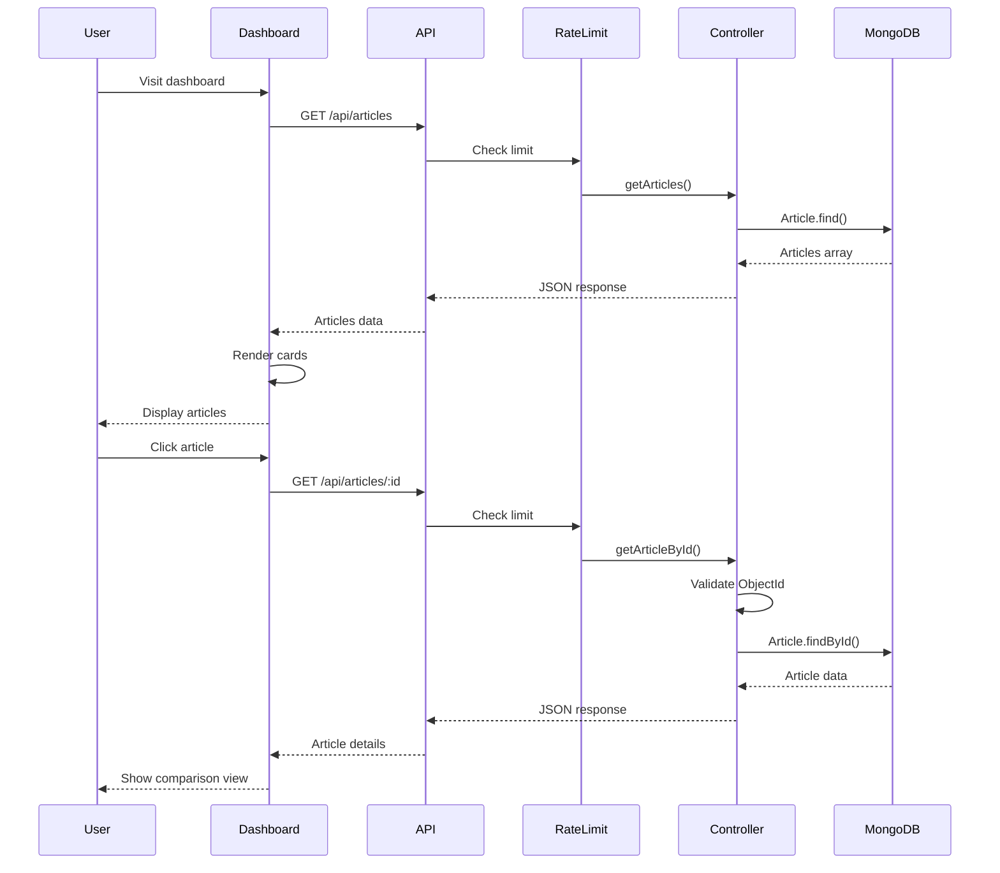

# Architecture Overview

## System Components

The Blog Management System consists of three main parts:

### 1. **Frontend** (React + Vite)
- User interface for managing blog articles
- Displays original vs AI-enhanced content side-by-side
- Supports light/dark mode
- Built with React, Tailwind CSS, and React Router

### 2. **Backend** (Node.js + Express)
- REST API for article management (CRUD operations)
- Connects to MongoDB database
- Provides endpoints for frontend to fetch/update articles

### 3. **Enhancement Scripts**
- `seed.js` - Scrapes initial articles from beyondchats.com
- `enhanceArticles.js` - Uses AI to improve article content

---

## Data Flow Diagrams

### Overall System Architecture



### Article Creation Flow



### Article Enhancement Flow



### Article Retrieval Flow



---

## How It Works

### Step 1: Seeding Articles
```
seed.js → Scrapes beyondchats.com → Saves to MongoDB
```
- Fetches the 5 oldest blog posts
- Stores title, content, and URL in database

### Step 2: Enhancing Articles
```
enhanceArticles.js → Google Search → Scrape Competitors → AI Rewrite → Save
```
1. For each article, search Google for similar content
2. Scrape top 2 competitor articles
3. Send to AI (Gemini/OpenAI) to create better version
4. Save enhanced content with references

### Step 3: Viewing Articles
```
User → Frontend → Backend API → MongoDB → Display
```
- Frontend fetches articles from backend
- Shows original and AI-enhanced versions side-by-side
- Users can create, edit, and delete articles

---

## Technology Stack

**Frontend:**
- React 19 + Vite
- Tailwind CSS (styling)
- React Router (navigation)
- Axios (API calls)
- React Markdown (content display)

**Backend:**
- Node.js + Express
- MongoDB + Mongoose
- Cheerio (web scraping)
- Axios (HTTP requests)

**AI & Search:**
- OpenAI/Gemini API (content enhancement)
- SerpAPI (Google search)

---

## Database Schema

```javascript
Article {
  title: String,           // Article title
  original_content: String, // Scraped content
  original_url: String,     // Source URL
  updated_content: String,  // AI-enhanced version
  references: [String],     // Competitor URLs used
  created_at: Date         // Creation timestamp
}
```

---

## API Endpoints

| Method | Endpoint | Description |
|--------|----------|-------------|
| GET | `/api/articles` | Get all articles |
| GET | `/api/articles/:id` | Get single article |
| POST | `/api/articles` | Create new article |
| PUT | `/api/articles/:id` | Update article |
| DELETE | `/api/articles/:id` | Delete article |

---

## Project Structure

```
Unified/
├── Backend_Assigment/
│   ├── src/
│   │   ├── controllers/    # Request handlers
│   │   ├── models/         # MongoDB schemas
│   │   ├── routes/         # API routes
│   │   ├── services/       # Business logic (LLM, scraping)
│   │   ├── scripts/        # seed.js, enhanceArticles.js
│   │   └── server.js       # Entry point
│   └── .env               # API keys & config
│
└── Frontend/
    ├── src/
    │   ├── components/    # React components
    │   ├── pages/         # Page components
    │   ├── services/      # API client
    │   └── App.jsx        # Main app
    └── index.html

```

---

## Key Features

✅ **Article Management** - Full CRUD operations  
✅ **AI Enhancement** - Automatic content improvement  
✅ **Comparison View** - See original vs enhanced side-by-side  
✅ **Dark Mode** - Light/dark theme support  
✅ **Markdown Editor** - Rich text editing with preview  
✅ **Validation** - Frontend (Zod) + Backend (Joi)  
✅ **Responsive Design** - Works on all screen sizes

---

## Running the Application

### Backend
```bash
cd Backend_Assigment
npm install
npm run seed      # Scrape initial articles
npm run enhance   # AI enhance articles
npm run dev       # Start server (port 5001)
```

### Frontend
```bash
cd Frontend
npm install
npm run dev       # Start dev server (port 5173)
```

---

## Environment Variables

Create `.env` in `Backend_Assigment/`:
```
PORT=5001
MONGO_URI=your_mongodb_connection_string
GEMINI_API_KEY=your_gemini_key
OPENAI_API_KEY=your_openai_key (optional fallback)
SERPAPI_KEY=your_serpapi_key
```

---

## Data Flow Example

**Creating an Article:**
```
User fills form → Frontend validates → POST /api/articles → 
Backend validates → Save to MongoDB → Return success → 
Frontend shows toast → Navigate to dashboard
```

**Viewing an Article:**
```
User clicks article → GET /api/articles/:id → 
Fetch from MongoDB → Return JSON → 
Frontend displays in ComparisonView component
```

---

## Design Decisions

1. **Separate Frontend/Backend** - Independent deployment and scaling
2. **Port 5001** - Avoids macOS AirPlay conflict on port 5000
3. **API-based Enhancement** - Script uses REST API instead of direct DB access
4. **Citations in Content** - References appended to `updated_content` string
5. **Shadcn-style UI** - Modern, accessible design system

---

## Future Improvements

- Add user authentication
- Implement caching (Redis)
- Add pagination for large article lists
- Queue system for batch processing
- Real-time updates with WebSockets
- Export articles to PDF/Markdown
