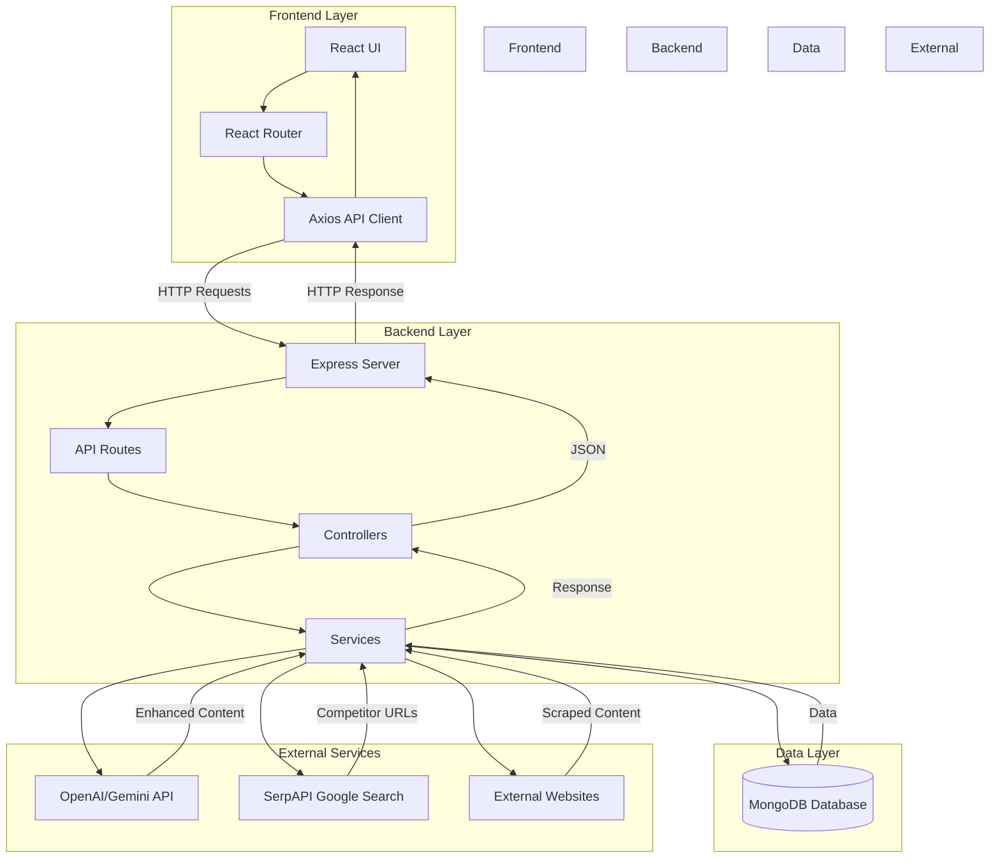
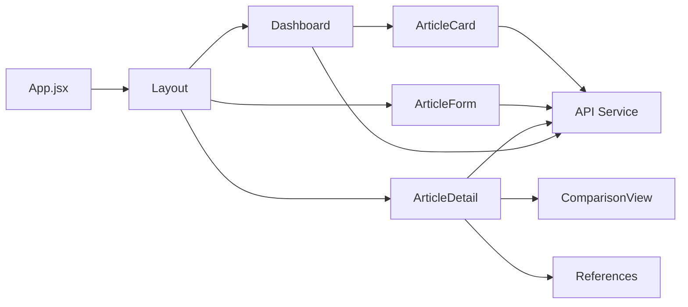
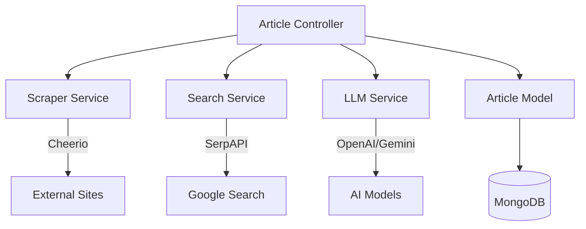
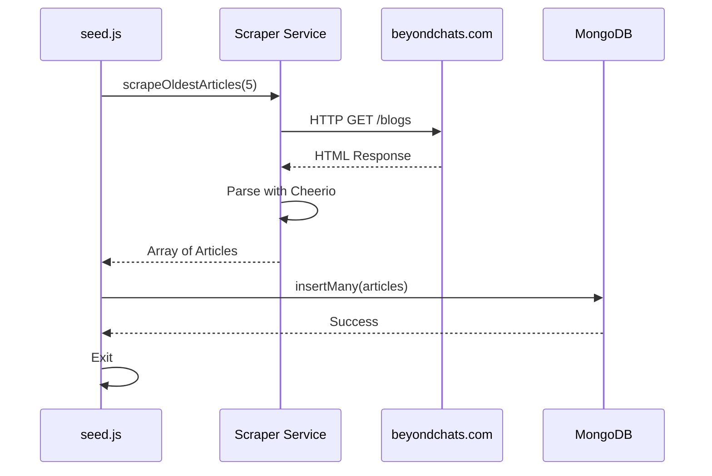
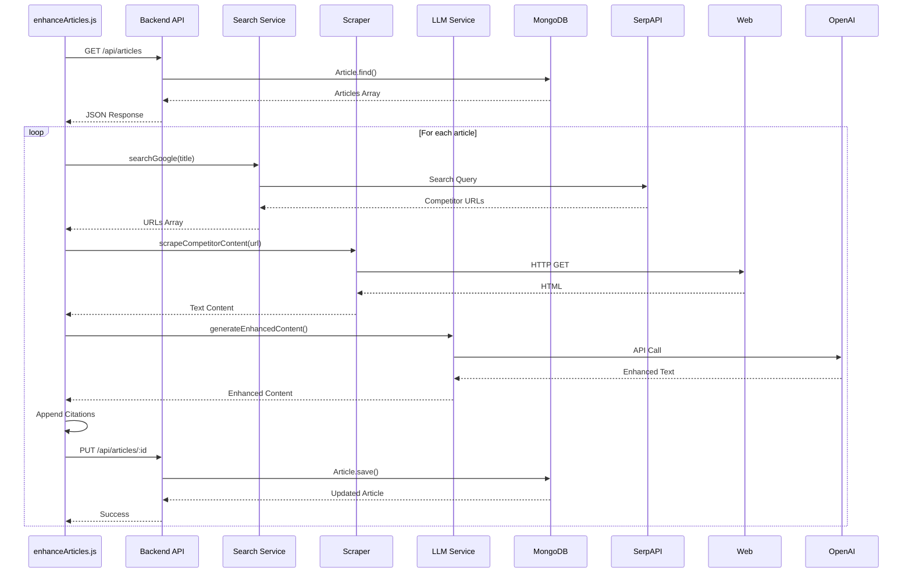
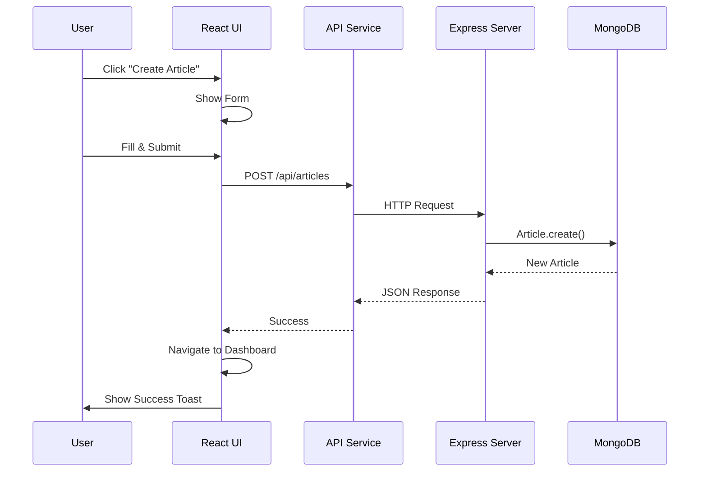
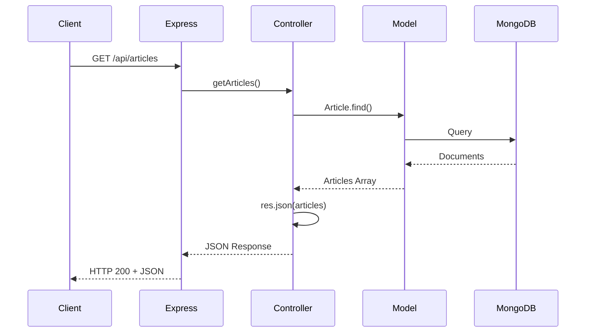
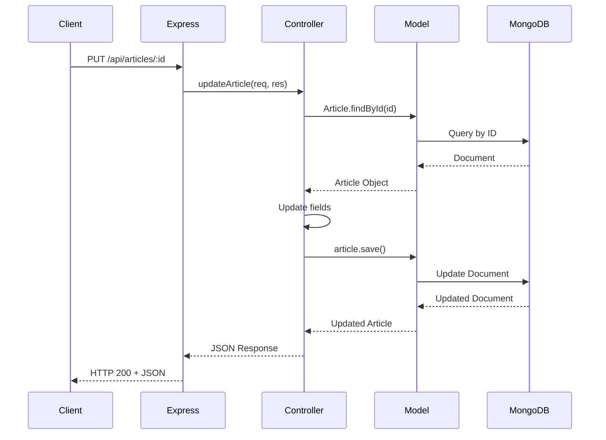

# System Architecture & Data Flow

## Overview

This document describes the architecture of the Blog Management System, including component interactions, data flow, and system design decisions.

## System Architecture Diagram



## Component Architecture

### Frontend Components



### Backend Services



## Data Flow Diagrams

### Phase 1: Article Seeding Flow



### Phase 2: Article Enhancement Flow



### Frontend CRUD Flow



## Database Schema

### Article Model

```javascript
{
  _id: ObjectId,
  title: String (required),
  original_content: String (required),
  original_url: String (required, unique),
  updated_content: String (optional),
  references: [String] (optional),
  created_at: Date (default: now)
}
```

## API Request/Response Flow

### Example: Get All Articles



### Example: Update Article



## Technology Stack

### Backend
- **Runtime**: Node.js v18+
- **Framework**: Express.js v5
- **Database**: MongoDB with Mongoose ODM
- **Web Scraping**: Cheerio
- **HTTP Client**: Axios
- **AI Integration**: OpenAI API / Gemini API
- **Search**: SerpAPI

### Frontend
- **Framework**: React 19
- **Build Tool**: Vite
- **Styling**: Tailwind CSS v3
- **Routing**: React Router v7
- **HTTP Client**: Axios
- **Notifications**: React Hot Toast
- **Icons**: Lucide React

## Design Decisions

### 1. API-First Enhancement Script
**Decision**: `enhanceArticles.js` uses REST API instead of direct database access.

**Rationale**:
- Follows separation of concerns
- Tests API endpoints
- Allows script to run independently of database credentials
- Easier to scale (script can run on different machine)

### 2. Citations in Content
**Decision**: Append references to `updated_content` string.

**Rationale**:
- Satisfies requirement of citations "at the bottom of article"
- Ensures citations are always displayed with content
- Simplifies frontend rendering (no separate logic needed)

### 3. Port 5001
**Decision**: Use port 5001 instead of 5000.

**Rationale**:
- macOS reserves port 5000 for AirPlay
- Avoids port conflicts
- Better developer experience

### 4. Separate Frontend/Backend
**Decision**: Maintain separate directories and servers.

**Rationale**:
- Clear separation of concerns
- Independent deployment
- Easier to scale horizontally
- Frontend can be deployed to CDN (Vercel/Netlify)

## Security Considerations

### Current Implementation
- CORS enabled for all origins (development)
- No authentication/authorization
- API keys in environment variables
- No rate limiting

### Production Recommendations
- Implement JWT authentication
- Add rate limiting middleware
- Restrict CORS to specific origins
- Use API key rotation
- Add input validation and sanitization
- Implement logging and monitoring
- Use HTTPS only

## Scalability Considerations

### Current Limitations
- Single server instance
- No caching layer
- Synchronous article processing
- No queue system

### Future Improvements
- Add Redis for caching
- Implement job queue (Bull/BullMQ) for article enhancement
- Use CDN for frontend assets
- Implement database indexing
- Add horizontal scaling with load balancer
- Implement microservices architecture for different concerns

## Performance Optimizations

1. **Database Queries**: Use `.lean()` for read-only operations
2. **API Responses**: Implement pagination for article lists
3. **Frontend**: Code splitting and lazy loading
4. **Caching**: Add Redis for frequently accessed data
5. **CDN**: Serve static assets from CDN
